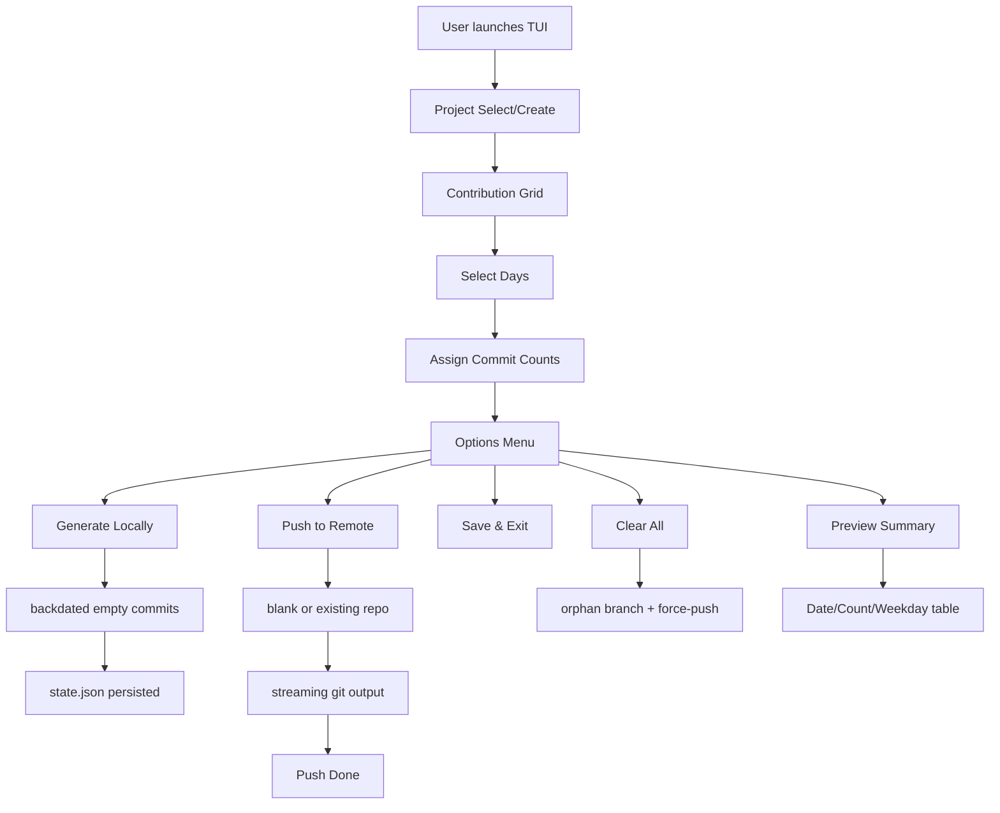
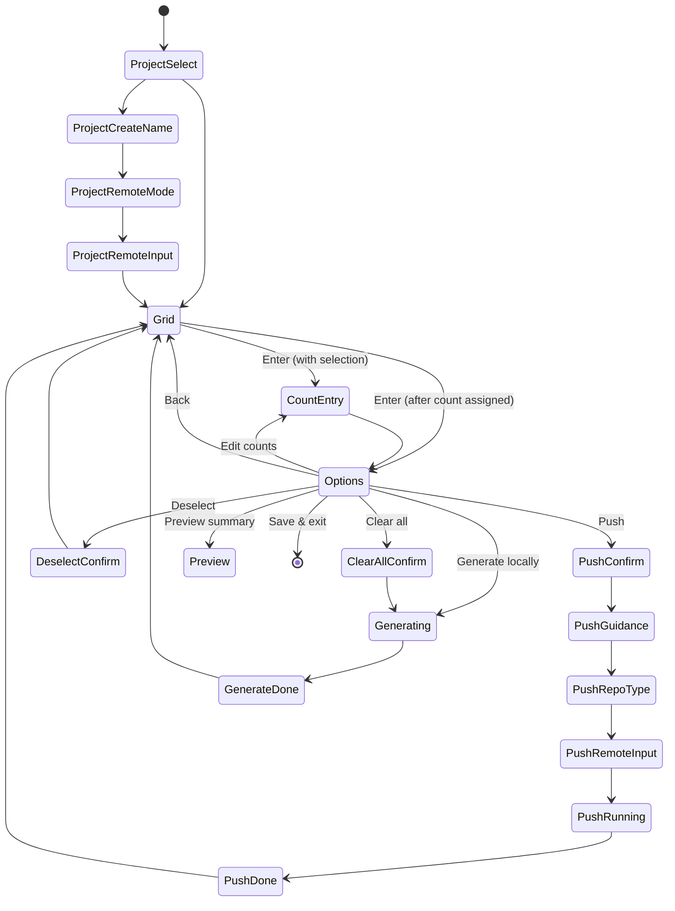

<div align="center">


# CommitForge

**A Go TUI application for crafting GitHub-style contribution calendars via backdated commits.**

[](https://github.com/hvmidrezv/Commit-Forge/actions/workflows/ci.yml)
[](https://github.com/hvmidrezv/Commit-Forge/releases/latest)
[](https://go.dev/)
[](https://github.com/hvmidrezv/Commit-Forge/blob/main/LICENSE)


[Features](#features) · [Architecture](#architecture) · [Installation](#installation) · [Usage](#usage) · [CLI Reference](#cli-reference) · [Keybindings](#tui-keybindings) · [Development](#development) · [Changelog](#changelog)

</div>

---

## Overview

CommitForge is a terminal-based (TUI) application written in Go that generates fake Git commits with backdated timestamps. It renders an interactive GitHub-style contribution grid in your terminal, letting you select days, assign commit counts, and generate the commits locally — then optionally push them to a remote repository.

The tool is designed for developers who want to **shape their GitHub contribution graph** for visual or personal reasons, with full control over which days receive commits and how many.

### How It Works

1. Launch the TUI panel — a contribution grid appears (default: last 1 year).
2. Navigate with arrow keys or Vim-style `hjkl`, select days with `space`, or range-select with `v`.
3. Assign commit counts per day: fixed number (`5`) or random range (`1-8`).
4. Choose an action from the options menu: generate locally, push to remote, preview summary, or save & exit.
5. CommitForge creates backdated empty commits in a local Git repository and pushes them if requested.

---

## Features

- **Interactive contribution grid** — GitHub-style 5-level green intensity calendar rendered in the terminal
- **18 TUI screens** — project selection, grid navigation, count assignment, options menu, push flow, help overlay
- **Vim-like navigation** — arrow keys and `hjkl` with context-aware keybindings per screen
- **Range and bulk selection** — select individual days, contiguous date ranges, or all visible days
- **Fixed or random commit counts** — assign exact counts or random min-max ranges per selected day
- **Backdated empty commits** — uses `git commit --allow-empty` with `GIT_AUTHOR_DATE` and `GIT_COMMITTER_DATE` env vars to set timestamps in the 09:00–17:00 UTC window
- **12 default commit messages** — realistic-looking generic messages (update, fix, refactor, chore, feature, etc.)
- **Push flow** — blank-repo and existing-repo modes with streaming git output
- **Force-push for history rewriting** — clear-all operation creates an orphan branch and force-pushes to origin/main
- **Remote management** — add/remove remote connections, auto-detect existing `origin`
- **Project/workspace management** — multiple projects under the output directory
- **JSON state persistence** — saves selections, counts, and configuration to `<dir>/.commitforge/state.json`
- **Autosave** — state saved every 5 seconds automatically
- **Cross-platform releases** — Linux, macOS, Windows (amd64/arm64) via GoReleaser
- **GitHub Actions CI/CD** — linting, testing with coverage, and automated release on version tags
- **Customizable CLI flags** — configure directory, years, commit message, message mode, remote, and more

---

## Architecture

```
┌─────────────────────────────────────────────────────────┐
│                      main.go                           │
│                   cmd.Execute()                        │
├─────────────────────────────────────────────────────────┤
│                     cmd/                               │
│  root.go (Cobra)  panel.go  help.go                   │
├─────────────────────────────────────────────────────────┤
│                   internal/                             │
│                                                         │
│  ┌─────────────┐  ┌──────────────┐  ┌───────────────┐ │
│  │     tui/     │  │  commit/     │  │   gitops/     │ │
│  │  Model       │  │  Generator   │  │   repo.go     │ │
│  │  Grid        │  │  Committer   │  │   push.go     │ │
│  │  Keymap      │  │              │  │   regenerate  │ │
│  │  Styles      │  └──────────────┘  │   clear.go    │ │
│  │  Views_*     │                     └───────────────┘ │
│  └─────────────┘                                        │
│  ┌──────────────┐  ┌──────────────┐                    │
│  │contribution/ │  │   state/     │                    │
│  │  Calendar    │  │   store.go   │                    │
│  │  Selection   │  │   model.go   │                    │
│  └──────────────┘  └──────────────┘                    │
└─────────────────────────────────────────────────────────┘
```

### Data Flow



### TUI Screen Flow



---

## Project Structure

```
commitforge/
├── main.go                         # Entry point — calls cmd.Execute()
├── cmd/
│   ├── root.go                     # Cobra root command with persistent flags
│   ├── panel.go                    # commitforge panel subcommand
│   └── help.go                     # Custom help text with examples
├── internal/
│   ├── tui/
│   │   ├── model.go                # Bubble Tea Model — state, Init/Update/View (~2000 lines)
│   │   ├── grid.go                 # Contribution grid rendering with Lip Gloss
│   │   ├── keymap.go               # Context-aware keybindings per screen
│   │   ├── styles.go               # Lip Gloss theme — GitHub green scale + accent colors
│   │   ├── views_selection.go      # Count entry screen
│   │   ├── views_options.go        # Options menu, preview, generating screens
│   │   ├── views_push.go           # Push flow screens (guidance, repo type, remote input, log)
│   │   └── views_help.go           # Help overlay with active keybindings
│   ├── contribution/
│   │   ├── calendar.go             # Build GitHub-like week/day grid for N years
│   │   └── selection.go            # Date selection model (toggle, range, bulk)
│   ├── commit/
│   │   ├── generator.go            # CountSpec, StaggerJobs, ApplyToCalendar
│   │   └── committer.go            # RunCommit, GenerateCommits (backdated git commits)
│   ├── gitops/
│   │   ├── repo.go                 # Git init, remote management
│   │   ├── push.go                 # Push modes, streaming output, error handling
│   │   ├── regenerate.go           # Rebuild history from state.json
│   │   └── clear.go                # Clear all commits (orphan branch + force-push)
│   └── state/
│       ├── store.go                # Save/Load state.json
│       └── model.go                # PersistedState struct
├── .github/workflows/
│   ├── ci.yml                      # CI: gofmt, go vet, test, golangci-lint
│   └── release.yml                 # Release: GoReleaser on v* tags
├── .goreleaser.yml                 # GoReleaser v2 config (cross-platform builds)
├── .golangci.yml                   # Linter config (govet, staticcheck, errcheck, etc.)
├── Makefile                        # build, test, lint, fmt, clean, install
├── go.mod / go.sum
├── LICENSE                         # MIT License
├── CHANGELOG.md                    # v0.1.0 release notes
├── README.md                       # This file (English)
└── README.fa.md                    # Persian documentation
```

---

## Tech Stack

| Component | Technology | Purpose |
|---|---|---|
| Language | [Go 1.24.0](https://go.dev/) | Core language |
| CLI Framework | [Cobra](https://github.com/spf13/cobra) | Command-line interface, flags, help |
| TUI Framework | [Bubble Tea](https://github.com/charmbracelet/bubbletea) | Elm-architecture terminal UI runtime |
| Terminal Styling | [Lip Gloss](https://github.com/charmbracelet/lipgloss) | Colors, borders, layout in terminal |
| Git Operations | `os/exec` with system `git` | Commit creation, push, remote management |
| State Persistence | JSON files | Save/load application state |
| Release | [GoReleaser](https://goreleaser.com/) | Cross-platform binary builds |
| CI/CD | [GitHub Actions](https://github.com/features/actions) | Automated testing and release |
| Linting | [golangci-lint](https://golangci-lint.run/) | Static analysis (govet, staticcheck, errcheck, etc.) |

---

## Requirements

- **Go** 1.24.0 or later
- **Git** installed and available in `$PATH`
- Terminal with color support (most modern terminals work out of the box)

---

## Installation

### From Source

```sh
# Clone the repository
git clone https://github.com/hvmidrezv/Commit-Forge.git
cd commitforge

# Build the binary
go build -o commitforge

# Or install to $GOPATH/bin
go install .
```

### Using Make

```sh
# Build (includes lint + test)
make

# Just build
make build
```

### Pre-built Binaries

Download the latest release from the [Releases page](https://github.com/hvmidrezv/Commit-Forge/releases/latest). Binaries are available for:

| Platform | Architecture |
|---|---|
| Linux | amd64, arm64 |
| macOS | amd64, arm64 |
| Windows | amd64, arm64 |

---

## Usage

### Launch the TUI

```sh
# Run directly with Go
go run main.go

# Run built binary — root command launches the panel
./commitforge

# Explicit panel subcommand
./commitforge panel
```

### Usage Walkthrough

1. **Project selection** — On first launch, create a new project by entering a name. If projects exist, select one from the list.
2. **Remote configuration** — Optionally connect to a GitHub repository (SSH or HTTPS URL). You can skip this and add a remote later.
3. **Contribution grid** — Navigate the GitHub-style calendar using arrow keys or `hjkl`. Move between years with `[` and `]`.
4. **Select days** — Press `space` to toggle individual days, `v` to start/confirm a contiguous date range, `a` to select all visible days, or `u` to clear selection.
5. **Assign commit counts** — Press `enter` to proceed. Enter a fixed count (`5`) or a random range (`1-8`). The grid updates live to preview intensity.
6. **Options menu** — Choose an action:
   - **Push to remote** — push generated history to the configured remote
   - **Add remote / connect** — connect to a remote repository URL
   - **Remove remote / disconnect** — keep project local-only
   - **Deselect all** — remove selections and optionally regenerate
   - **Clear all commits** — destructive: rewrite history and force-push
   - **Edit counts** — re-open count assignment for current selection
   - **Generate locally** — create commits without pushing
   - **Preview summary** — table of date, weekday, and commit count
   - **Save & exit** — persist state and quit
   - **Back** — return to grid
7. **Push flow** — Confirm push → read setup guidance → choose blank or existing repo → enter remote URL → watch streaming git output.

---

## CLI Reference

### Commands

| Command | Description |
|---|---|
| `commitforge` | Launch the TUI panel (default) |
| `commitforge panel` | Explicitly launch the TUI panel |
| `commitforge help` | Show help text with usage, flags, and examples |

### Flags

| Flag | Default | Description | Example |
|---|---|---|---|
| `--dir` | `output` | Target output/working directory | `--dir ./my-graph` |
| `--years` | `1` | Number of years back to render in the grid | `--years 2` |
| `--message` | *(random)* | Fixed commit message for all commits | `--message "update"` |
| `--message-mode` | `random` | Commit message mode: `random` or `fixed` | `--message-mode fixed` |
| `--remote` | *(none)* | Pre-fill remote URL, skip prompt | `--remote git@github.com:user/repo.git` |
| `--no-push` | `false` | Skip push flow entirely, generate only | `--no-push` |
| `--yes` | `false` | Auto-confirm prompts where possible | `--yes` |
| `-h, --help` | — | Show help and examples | `--help` |

### Examples

```sh
# Generate commits in a custom directory with 2 years of history
commitforge --dir ./my-graph --years 2

# Generate with a fixed commit message, no push
commitforge --message "chore: update" --message-mode fixed --no-push

# Pre-fill remote URL and auto-confirm
commitforge --remote git@github.com:user/repo.git --yes

# View help
commitforge help
commitforge --help
```

---

## TUI Keybindings

Keybindings are **context-aware** — the active set changes depending on which screen you're on.

### Global Keys

| Keys | Action |
|---|---|
| `q`, `Ctrl+C` | Quit the application |
| `?` | Toggle help overlay (shows active keybindings for current screen) |
| `Esc`, `Backspace` | Go back to previous screen (preserves in-memory state) |

### Grid Navigation

| Keys | Action |
|---|---|
| `↑` `↓` `←` `→` | Move cursor one day in that direction |
| `h` `j` `k` `l` | Move cursor (Vim-style alternative) |
| `[` / `PgUp` | Shift year window backward |
| `]` / `PgDn` | Shift year window forward |

### Selection

| Keys | Action |
|---|---|
| `Space` | Toggle selection of the day under the cursor |
| `v` | Start range selection (press once to anchor, move cursor, press again to confirm) |
| `a` | Select all visible days |
| `u` | Clear all selections |
| `x` | Clear all commits (destructive — requires confirmation) |

### Actions

| Keys | Action |
|---|---|
| `Enter` | Confirm / proceed to next step |
| `y` / `n` | Confirm or cancel (push confirmation, etc.) |

### Screen-Specific Input

| Screen | Input |
|---|---|
| Count entry | Digits and `-` for range format (e.g., `5` or `1-8`) |
| Push remote input | URL characters (`a-z`, `0-9`, `:`, `/`, `.`, `_`, `-`, `@`) |
| Push log screen | `↑` / `↓` to scroll the streaming git output |
| Clear-all confirmation | Type `yes` or the project name, then `Enter` |

---

## Commit Generation

### How Commits Are Created

CommitForge creates **empty Git commits** with backdated timestamps using:

```sh
GIT_AUTHOR_DATE=<timestamp> GIT_COMMITTER_DATE=<timestamp> \
  git commit --allow-empty --date=<timestamp> -m "<message>"
```

### Timestamp Distribution

Commits for each day are staggered across the **09:00–17:00 UTC** window to appear natural. Multiple same-day commits receive distinct timestamps within this window.

### Count Assignment Modes

| Mode | Input | Behavior |
|---|---|---|
| Fixed | `5` | Every selected day gets exactly 5 commits |
| Random | `1-8` | Each selected day gets a random count between 1 and 8 |

### Default Commit Messages

When `--message-mode` is `random` (default), commits use messages from this pool:

| # | Message |
|---|---|
| 1 | update |
| 2 | fix |
| 3 | refactor |
| 4 | chore |
| 5 | feature |
| 6 | patch |
| 7 | improvement |
| 8 | tweak |
| 9 | adjustment |
| 10 | cleanup |
| 11 | optimization |
| 12 | maintenance |

---

## State Persistence

### State File

Application state is saved to `<dir>/.commitforge/state.json` and includes:

| Field | Description |
|---|---|
| `Version` | State schema version |
| `SelectedDir` | Active project directory |
| `SelectedDates` | Chronologically sorted list of selected dates |
| `DateCounts` | Map of date → commit count |
| `GeneratedDateCounts` | Counts after generation (for regeneration) |
| `Message` | Custom commit message (if set) |
| `MessageMode` | `random` or `fixed` |
| `RemoteURL` | Configured remote URL |

### Autosave

State is automatically saved:
- Every **5 seconds** via a background tick
- After meaningful state changes (selection, count assignment, remote configuration)

### Resume

If a state file exists at startup, CommitForge restores:
- Previous date selections
- Commit counts per day
- Message and message mode settings
- Remote URL configuration

---

## Testing

### Run All Tests

```sh
go test ./...
```

### Run with Coverage

```sh
go test ./... -cover
```

### Run Specific Packages

```sh
# Contribution calendar and selection logic
go test ./internal/contribution/...

# Commit generation and staggering
go test ./internal/commit/...

# TUI model and grid rendering
go test ./internal/tui/...
```

### Lint

```sh
# Run go vet
go vet ./...

# Run golangci-lint (requires golangci-lint installed)
golangci-lint run

# Or use Make
make lint
```

### Format

```sh
# Check formatting
gofmt -l .

# Auto-format
make fmt
```

---

## Local Go Docs

### Package Documentation (Terminal)

```sh
# List all packages
go doc ./...

# Specific package
go doc commitforge/internal/tui
go doc commitforge/internal/commit
go doc commitforge/internal/contribution
go doc commitforge/internal/gitops
go doc commitforge/internal/state

# Specific symbol
go doc commitforge/internal/tui.Model
go doc commitforge/internal/commit.CountSpec
```

### Local Docs Server

```sh
# Install godoc
go install golang.org/x/tools/cmd/godoc@latest

# Start the server
godoc -http=:6060

# Open in browser
# http://localhost:6060/pkg/commitforge/
```

---

## Docker

CommitForge is a terminal application and does not provide a Docker image. It runs natively on Linux, macOS, and Windows.

---

## Makefile Reference

| Command | Description |
|---|---|
| `make` | Run lint + test + build (default) |
| `make build` | Build the binary |
| `make run` | Build and run the TUI |
| `make test` | Run all tests |
| `make lint` | Run golangci-lint |
| `make fmt` | Auto-format Go source files |
| `make vet` | Run go vet |
| `make clean` | Remove build artifacts |
| `make install` | Install binary to $GOPATH/bin |

The binary version is derived from Git tags via `git describe --tags --always`.

---

## CI/CD

### CI Pipeline (`.github/workflows/ci.yml`)

Triggered on every push and pull request:

1. **gofmt check** — ensures all Go files are properly formatted
2. **go vet** — static analysis for common issues
3. **Test with coverage** — runs `go test ./... -cover`
4. **golangci-lint** — comprehensive linting (govet, staticcheck, errcheck, gosimple, unused, gofmt, goimports)

### Release Pipeline (`.github/workflows/release.yml`)

Triggered on version tags (`v*`):

1. Checks out code
2. Sets up Go
3. Runs GoReleaser to build cross-platform binaries and create a GitHub release

### GoReleaser Configuration (`.goreleaser.yml`)

- Builds for: `linux`, `darwin`, `windows` × `amd64`, `arm64`
- `CGO_ENABLED=0` for fully static binaries
- Archives contain raw binaries (no tar.gz wrapper)
- Changelog groups commits by conventional commit type

---

## Security Notes

- CommitForge does **not** store or transmit any credentials. Git authentication is handled by your system's Git configuration (SSH keys, credential helpers, etc.).
- The `--remote` flag accepts SSH (`git@github.com:user/repo.git`) and HTTPS (`https://github.com/user/repo.git`) URLs. URL validation is performed before use.
- Push operations handle non-fast-forward errors with automatic force-push retry and clear error messages.
- The **Clear All** operation is destructive — it creates an orphan branch, removes all files, and force-pushes to `origin/main`. It requires typing the project name or `yes` to confirm.

---

## Error Handling

CommitForge provides friendly error messages for common push failures:

| Error | Message |
|---|---|
| Non-fast-forward | Automatic force-push retry with explanation |
| Authentication failure | Clear guidance on SSH key / credential setup |
| Remote not found | Setup guidance with exact commands |
| Network unavailable | Connection error with troubleshooting tips |
| Remote URL invalid | Validation error with expected format |

---

## Roadmap

Planned features for future releases:

- [ ] Custom commit message file support (`--messages-file`)
- [ ] Interactive date range presets (last month, last quarter, etc.)
- [ ] Undo/regenerate individual days
- [ ] Import existing contribution data
- [ ] Theme customization (color schemes)
- [ ] Export contribution summary as Markdown table
- [ ] Support for multiple concurrent projects
- [ ] Configuration file (`.commitforge.yaml`)
- [ ] Shell completions (bash, zsh, fish)

---

## Contributing

Contributions are welcome! Here's how to get started:

1. Fork the repository
2. Create a feature branch: `git checkout -b feature/my-feature`
3. Make your changes
4. Run tests: `make test`
5. Run linter: `make lint`
6. Commit your changes (commit messages follow [Conventional Commits](https://www.conventionalcommits.org/))
7. Push to your fork: `git push origin feature/my-feature`
8. Open a Pull Request

### Development Setup

```sh
# Clone and enter the project
git clone https://github.com/hvmidrezv/Commit-Forge.git
cd commitforge

# Build and test
make

# Run the TUI
make run
```

---

## Changelog

See [CHANGELOG.md](CHANGELOG.md) for a detailed history of changes.

### v0.1.0 (2026-08-27)

Initial release:
- Interactive TUI grid for shaping a GitHub contribution calendar
- Backdated empty-commit generation with configurable counts per day
- Range selection and bulk select/clear
- Push flow: blank-repo and existing-repo modes, streaming git output
- JSON state persistence with autosave
- CLI flags: `--dir`, `--years`, `--message`, `--message-mode`, `--remote`, `--no-push`, `--yes`
- Regenerate command that rebuilds history from saved state
- Clear-all command that wipes generated commits and force-pushes

---

## License

This project is licensed under the MIT License — see the [LICENSE](LICENSE) file for details.

---

## Author

**HamidReza** — [GitHub](https://github.com/hvmidrezv)

---

<div align="center">

**Built with ❤️ using Go, Bubble Tea, and Lip Gloss**

</div>
